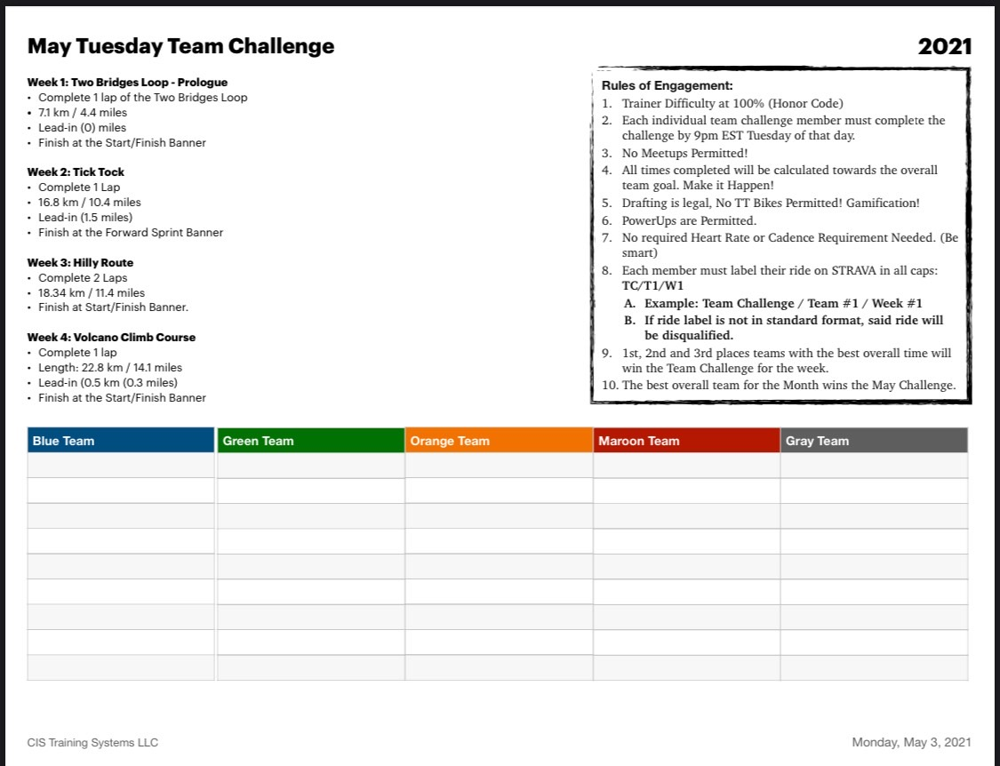

## May Challenge

## Week 1: Two Bridges Loop - Prologue
- Complete 1 lap of the [Two Bridges Loop](https://zwiftinsider.com/route/two-bridges-loop/)
- 7.1 km / 4.4 miles
- Lead-in (0) miles
- Finish at the Start/Finish Banner

## Week 2: Tick Tock
- Complete 1 Lap of the [Tick Tock Route](https://zwiftinsider.com/route/tick-tock/)
- 16.8 km / 10.4 miles
- Lead-in (1.5 miles)
- Finish at Forward Sprint Banner

## Week 3: Hilly Route
- Complete 2 Laps of [Hilly Route](https://zwiftinsider.com/route/hilly-route/)
- 18.34 km / 11.4 miles
- Finish at Start/Finish Banner

## Week 4: Volcano Climb Course
- Complete 1 lap of [Volcano Climb Course](https://zwiftinsider.com/route/volcano-climb/)
- 22.8 km / 14.1 miles
- Lead-In (0.3 miles)
- Finish at the Start/Finish Banner

## Rules of Engagement
1.[ Trainer Difficulty at 100% (Honors Code)](https://www.zwift.com/video/how-to-cycling/adjust-smart-trainer-difficulty)
2. Each individual team challenge member must complete the challenge by 9pm EST Tuesday of that day.
3. No meetups Permitted!
4. All times completed will be calculated towards the overall team goal. Make it Happen!
5. Drafting is legal, No TT Bikes Permitted! Gamification!
6. PowerUps are Permitted.
7. No required Heart Rate or Cadence Requirement Needed. (Be Smart)
8. Each member must label their ride on STRAVA in all caps

Label Examples:
- __TC/PROLOUGE/W1__
- __TC/[TEAM NAME]/W2__

## Resources
- [Speed Tests: Flat/Rolling Races](https://zwiftinsider.com/fastest-frames/)
- [Speed Tests: Climbing Races](https://zwiftinsider.com/fastest-bike-frames-for-climbing/)
- [Speed Tests: TT Bikes](https://zwiftinsider.com/fastest-tt-bikes/)
- [Speed Tests: Wheelset](https://zwiftinsider.com/charts-wheels/)
- [Zwift Powerups](https://zwiftinsider.com/powerups/)

## FAQ
> Is this a race?

This is not a race, this is just a workout based on your current level of fitness. Focus on your training and what you have learned so far.

> Do I need a working heart rate meter?

See Rules of Engagment item #7

> Do I have multiple attempts to do the challenge?

No, you have one attempt only.

> Can I recon the route before hand?

Yes you are allowed to ride the route before your attempt.
